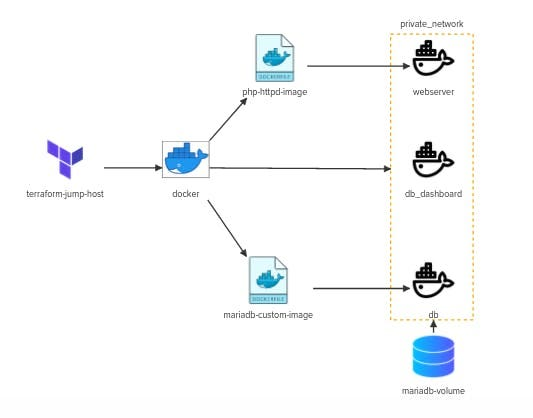

## Welcome to the terraform challenge series.
In this challenge we will implement a simple LAMP stack using terraform and docker.

- Install terraform binary version=1.1.5 on iac-server

Run init.sh to install Terraform bynary.

### Docker provider has already been configured using kreuzwerker/docker provider.
Check out the provider.tf given at /root/code/terraform-challenges/challenge2

### Create a terraform resource named php-httpd-image for building docker image with following specifications:
- Image name: php-httpd:challenge
- Build context: lamp_stack/php_httpd
- Labels: challenge: second

### Create a terraform resource named mariadb-image for building docker image with following specifications:
- Image name: mariadb:challenge
- Build context: lamp_stack/custom_db
- Labels: challenge: second

### Define a terraform resource php-httpd for creating docker container with following specification:
- Container Name: webserver
- Hostname: php-httpd
- Image used: php-httpd:challenge
- Attach the container to network my_network
- Publish a container's port(s) to the host:
  - Hostport: 0.0.0.0:80
  - containerPort: 80
- Labels: challenge: second
- Create a volume with host_path /root/code/terraform-challenges/challenge2/lamp_stack/website_content/ and container_path /var/www/html within webserver container.

### Define a terraform resource phpmyadmin for docker container with following configurations:
- Container Name: db_dashboard
- Image Used: phpmyadmin/phpmyadmin
- Hostname: phpmyadmin
- Attach the container to network my_network
- Publish a container's port(s) to the host:
  - Hostport: 0.0.0.0:8081
  - containerPort: 80
- Labels: challenge: second
- Establish link based connectivity between db and db_dashboard containers (Deprecated)
- Explicitly specify a dependency on mariadb terraform resource

### Define a terraform resource mariadb for creating docker container with following specification:
- Container Name: db
- Image Used: mariadb:challenge
- Hostname: db
- Attach the container to network my_network
- Publish a container's port(s) to the host:
  - Hostport: 0.0.0.0:3306
  - containerPort: 3306
- Labels: challenge: second
- Define environment variables inside mariadb resource:
  - MYSQL_ROOT_PASSWORD=1234
  - MYSQL_DATABASE=simple-website
- Attach volume mariadb-volume to /var/lib/mysql directory within db container.

### Create a terraform resource named mariadb_volume creating a docker volume with name=mariadb-volume

## Architecture Diagram
