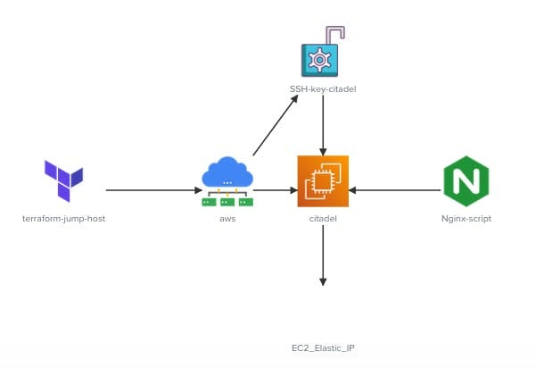

## Welcome to the terraform challenge series.
In this challenge we will implement a simple EC2 instance with some preinstalled packages.

### Amazon Web Services (AWS) provider have been configured already to interact with the many resources supported by AWS.

### Create a Key-Pair with following specifications:
- Create a terraform key-pair citadel-key with key_name citadel.
- Upload the public key ec2-connect-key.pub to the resource. You may use the file function to read the the public key at /root/terraform-challenges/project-citadel/.ssh

### Create a EC2 instance with following specifications:
- AMI: ami-06178cf087598769c, use variable named ami
- Region: eu-west-2, use variable named region
- Instance Type: m5.large, use variable named instance_type
- Elastic IP address attached to the EC2 instance

### Create a local-exec with following specifications:
- Create a local-exec provisioner for the eip resource and use it to print the attribute called public_dns to a file /root/citadel_public_dns.txt on the iac-server

### Install nginx on citadel instance
- Install nginx on citadel instance, make use of the user_data argument.
- Using the file function or by making use of the heredoc syntax, use the script called install-nginx.sh as the value for the user_data argument.

## Architecture Diagram
